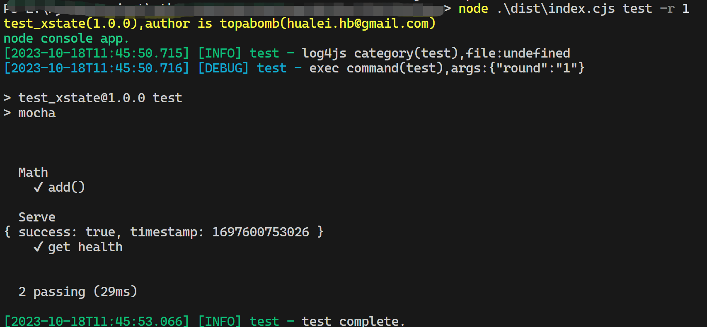

# console-craft

Simplify console program development, standardize program parameters and log output, and provide support for user interaction or command-line parameters to start the main program and subcommands.令。

## Use Cases

- Support multiple subcommands.

- Global parameters and subcommand parameters.

- Program parameters can be obtained from environment variables and the command line.

- Built-in dotenv handling, program parameters can also be obtained from dotenv.

- Parameter source priority: interactive input > command-line parameters > environment variables > dotenv.

- You can select subcommands and parameters through user interaction.

- You can directly launch subcommands through command-line parameters.

- It includes the log4js library, and you can set the log format through parameters.

- It includes Commander, Inquirer, and Chalk for enriching program interaction and appearance.

## Example

- project example，[GitHub - topabomb/console-craft-example](https://github.com/topabomb/console-craft-example)

  > The program includes two subcommands: 'serve' which starts an HTTP server, and 'test' which directly invokes local testing with Mocha.

```typescript
import { execa } from "execa";
import { cli } from "console-craft";
import { service } from "./serve";
const commands = [
  { name: "serve", args: [{ flags: "-p, --port <port>", default: 3000 }] },
  { name: "test", args: ["-r, --round <round>"] },
];
cli.initialize(commands, {
  globalArgs: [
    { flags: "-c, --config <config>", description: "config file" },
    "-log,  --log-level",
  ],
  author: "topabomb(hualei.hb@gmail.com)",
  description: "node console app.",
});
cli.command("serve", async ({ name, args, logger }) => {
  const port = Number(args["port"]);
  await service.start(port);
  logger.level = args["log-level"] ? args["log-level"] : "debug";
  logger.info(`${name} listening : http://localhost:${args["port"]}`);
});
cli.command("test", async ({ name, args, logger }) => {
  await service.start(3000);
  const round = args["round"] ? Number(args["round"]) : 1;
  for (let i = 0; i < round; i++)
    await execa("npm", ["run", "test"]).pipeStdout(process.stdout);
  await service.close();
  logger.log("test complete.");
});
void cli.run();
```

- Interactive mode screenshot

  - serve

  

  - test

  

- Command-line parameter mode screenshot

  - serve

  

  - test

    

## Install

```shell
npm install console-craft
```

## Usage

### cli

- initialize

  ```typescript
  cli.initialize(commands, {
    globalArgs: [
      { flags: "-c, --config <config>", description: "config file" },
      "-log,  --log-level",
    ],
    author: "topabomb(hualei.hb@gmail.com)",
    description: "node console app.",
  });
  ```

  flags format:

  ```
  -short, --long <name>
  -short, --long [name]
  -short, --long
  -short
  --long
  ```

- command

  ```typescript
  cli.command("serve", async (cmd) => {
    const port = Number(cmd.args["port"]);
    await service.start(port);
    cmd.logger.info(
      `${cmd.name} listening : http://localhost:${cmd.args["port"]}`
    );
  });
  ```

- run

  ```typescript
  void cli.run();
  ```

### inquirer

[GitHub - SBoudrias/Inquirer.js: A collection of common interactive command line user interfaces.](https://github.com/SBoudrias/Inquirer.js)

### chalk

[GitHub - chalk/chalk: 🖍 Terminal string styling done right](https://github.com/chalk/chalk/)

### logger

https://log4js-node.github.io/log4js-node/
