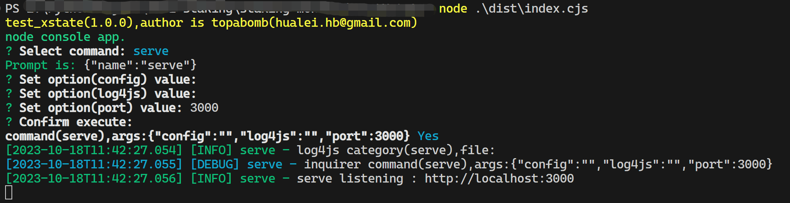
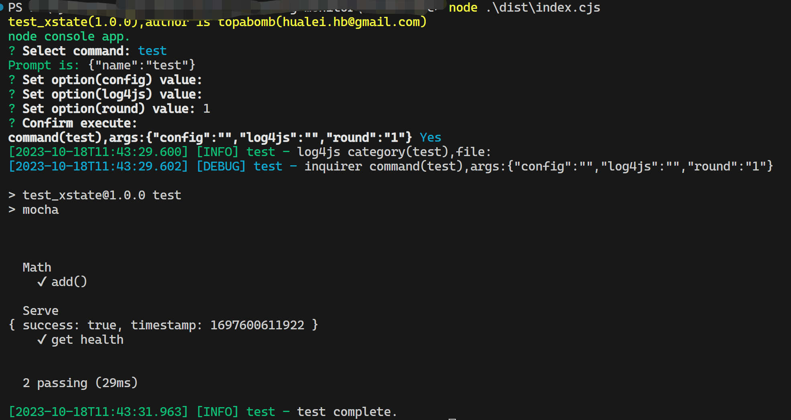
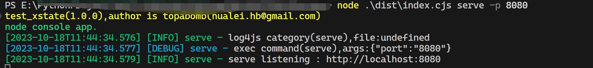
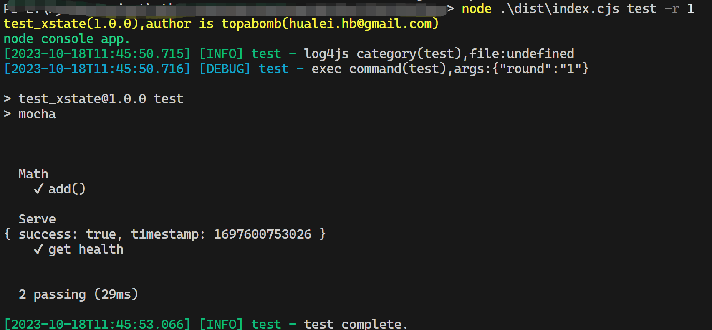

# console-craft

简化控制台程序开发，标准化程序参数和日志输出，支持用户交互或者命令行参数方式来启动程序和子命令。

## 介绍

- 支持多个子命令

- 全局参数及子命令参数

- 参数可以从环境变量、命令行中获取

- 可以通过用户交互来选择子命令和参数

- 可以通过命令行参数来直接启动子命令

- 内置了log4js库，通过参数来设置log的格式

- 内置了inquirer、chalk，用于丰富程序的交互及外观

## 演示

- 代码样例
  
  > 该程序包括 serve 及 test 两个子命令，serve 中启动一个 http 服务端程序，test 直接调用 mocha 的本地测试。

```typescript
import { execa } from "execa";
import { cli } from "console-craft";
import { service } from "./serve";
//flags:https://github.com/tj/commander.js/tree/master#options
const commands = [
  { name: "serve", args: [{ flags: "-p, --port <port>", default: 3000 }] },
  { name: "test", args: ["-r, --round <round>"] },
];
cli.initialize(commands, {
  globalArgs: [{ flags: "-c, --config <config>", description: "config file" }],
  author: "topabomb(hualei.hb@gmail.com)",
  description: "node console app.",
});
cli.command("serve", async (cmd) => {
  const port = Number(cmd.args["port"]);
  await service.start(port);
  cmd.logger.info(
    `${cmd.name} listening : http://localhost:${cmd.args["port"]}`
  );
});
cli.command("test", async (cmd) => {
  await service.start(3000);
  const round = cmd.args["round"] ? Number(cmd.args["round"]) : 1;
  for (let i = 0; i < round; i++) {
    await execa("npm", ["run", "test"]).pipeStdout(process.stdout);
  }
  await service.close();
  cmd.logger.log("test complete.");
});
void cli.run();
```

- 交互模式截图
  
  - serve
  
  
  
  - test
  
  

- 参数模式截图
  
  - serve
  
  
  
  - test
    
    

## 安装

```shell
npm install console-craft
```

## 使用说明

# 

### cli

- initialize

- command

- run

### inquirer

### chalk

### logger
